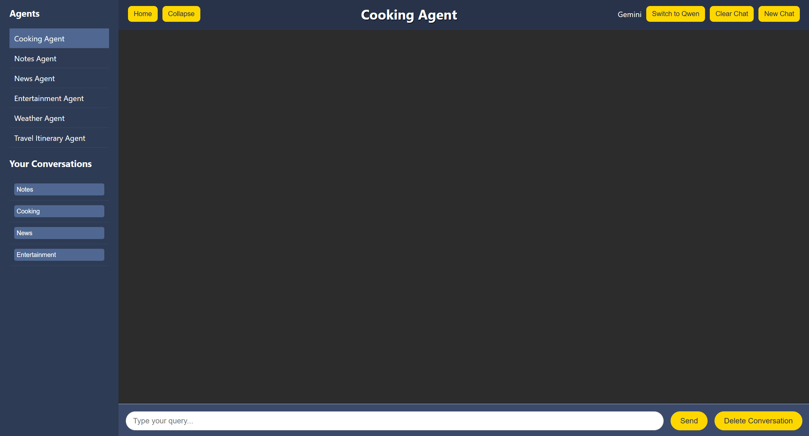

# PRISM: A Multi-Modal Agent 🌐🤖

> A unified web-based platform integrating multiple intelligent AI agents with real-time, multi-modal capabilities. Built for productivity, accessibility, and user-centric interaction — all on the frontend with zero backend/database dependencies.

---

## 🧠 Overview

PRISM is an innovative multi-agent system that brings together six powerful AI-driven agents into a single, seamless user experience:

- 🍳 **Cooking Agent**: Provides recipes, ingredients, and YouTube video tutorials.
- 📝 **Notes Agent**: Lets users create, update, delete, and view timestamped notes.
- 🎬 **Entertainment Agent**: Recommends personalized movies/series.
- ✈️ **Travel Planner Agent**: Generates itineraries and packing lists.
- ☁️ **Weather Agent**: Fetches real-time weather updates using APIs.
- 📰 **News Agent**: Displays live news articles based on user interests.

Each agent runs independently but collaborates to provide context-aware responses — powered by LLMs like **Qwen 2.5:3B** and **Gemini 1.5 Flash 8B**. Users can toggle between models for optimal performance.

---

## 🔍 Features

- 🤖 Model Toggle: Switch between `Qwen 2.5:3B` and `Gemini 1.5 Flash 8B`.
- 📡 Real-time data using external APIs (SerpAPI, YouTubeAPI, WeatherAPI, NewsAPI, GoogleAPI).
- 💬 Modular AI agents for different task domains.
- 💻 Frontend-only implementation — no backend/database required.
- 🌐 Built with ReactJS + LangChain + Ollama.

---

## 🛠️ Tech Stack

| Area              | Tools / Technologies                                  |
|-------------------|-------------------------------------------------------|
| Frontend          | ReactJS, CSS                                          |
| AI Models         | Qwen 2.5:3B (via Ollama), Gemini 1.5 Flash 8B         |
| LLM Framework     | LangChain                                             |
| APIs Used         | SerpAPI, YouTubeAPI, WeatherAPI, NewsAPI, GoogleAPI  |
| Agent Execution   | ReAct Framework, LangChain Agents                     |

---

## 🚀 Getting Started

> ⚠️ **Note:** Create a virtual environment of your choice before proceeding.

### 🔧 Step-by-Step Setup

```bash
# 1. Pull the Qwen model
ollama pull qwen2.5:3b

# 2. Set up API keys (use .env or inject in code)
# Required APIs:
# - SERPAPI_KEY
# - YOUTUBEAPI_KEY
# - WEATHERAPI_KEY
# - NEWSAPI_KEY
# - GOOGLEAPI_KEY (for Gemini Flash model)

# 3. Start the backend server for model orchestration (LangChain + Ollama)
uvicorn server:app --reload

# 4. Navigate to the frontend folder
cd frontend

# 5. Install frontend dependencies
npm install

# 6. Start the frontend server
npm start

# 7. Open in browser
http://localhost:3000

```

## 🖼️ Screenshots

### 🏠 Home Page
[](screenshots/home.png)

### 📋 Main Page


### 🍳 Cooking Agent


### 🎬 Entertainment Agent


### 📰 News Agent


